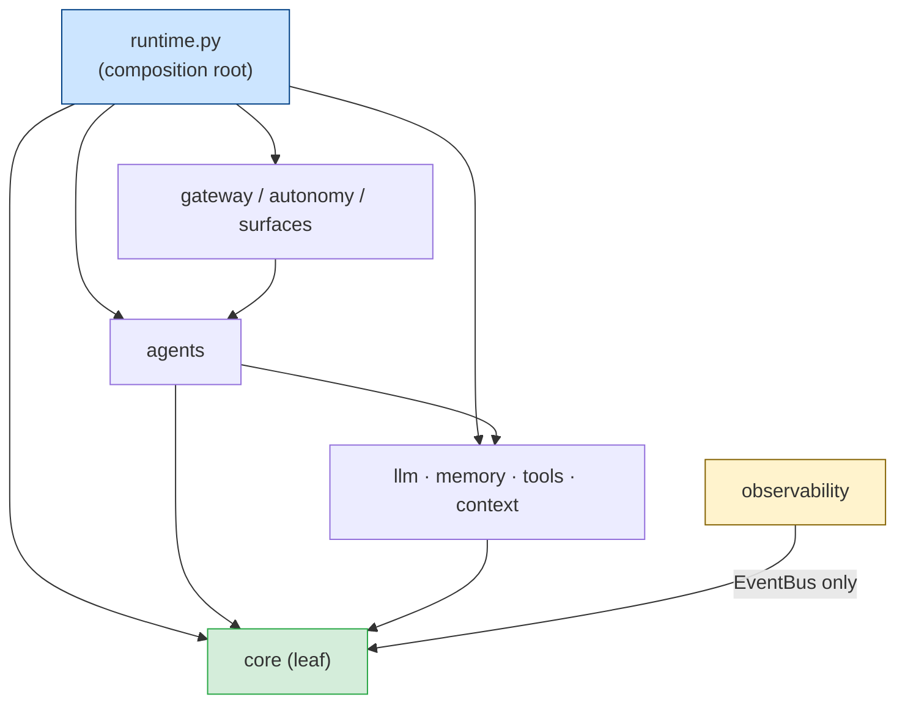

# HiveOS — Architecture (authoritative, current system)

> **This documents the system as actually built** (the installable `hive` package),
> with every claim citing a real `src/hive/...` path. Companions:
> `docs/STATUS.md` (what's done / gaps) and `docs/references/HIVEOS_COMPONENTS.md`
> (per-module table). The original *plan* lives in `docs/references/SYNTHESIS.md`
> (historical). Part II below keeps the design **rationale** (the "why").

HiveOS is the system; **Hive** is the agent. Python-first, async, installable as `hive`.

The dashboard also contains an isolated UI concept preview selected by the
`?ui-preview=1` query flag (`dashboard/src/ui-preview/`). It uses static fixtures,
does not construct `Centre`, does not require a Hive token and performs no gateway
requests. Its purpose is to validate page hierarchy and future API contracts. It is
not a production surface; see `docs/UI_RELATIONS_AND_API.md`. The 29-state interaction
and responsive audit is recorded in `docs/UI_AUDIT_2026-08-22.md`.

> **Coverage confidence** (mirrors Hermes/OpenJarvis reference style)
>
> | Section | Coverage | Notes |
> |---|---|---|
> | runtime.py / composition root | **A** — exhaustive | Every field and build-time wire documented |
> | gateway / API surfaces | **A** — exhaustive | 100+ endpoints across 19 groups; see also `docs/API.md` |
> | core/spec_search + self_mod | **A** — exhaustive | Full tiered loop, PROTECTED guard, worktree lifecycle |
> | llm / adapters / failover | **B** — sampled | Key paths; pricing + rate-limit headers sampled |
> | memory / Mnemosyne + local | **B** — sampled | Provider contract and host-LLM bridge covered; BEAM/sleep internals deferred to Mnemosyne docs |
> | autonomy / heartbeat | **B** — sampled | Tick sequence described; cron/commitment internals enumerated |
> | tools / MCP client+server | **B** — sampled | Build-time wiring; stdio vs SSE transport noted |
> | surfaces / CLI / voice | **C** — enumerated | Commands listed; voice needs audio host (VPS deferred) |
> | observability | **B** — sampled | Three modules; event types listed in section 6; new diagnostic methods in section 4 |

---

# Part I — The built system

## 1. Identity & safety spine (never bypass)
- `Config/SOUL.md` — immutable identity + safety contract. Loaded read-only via
  `src/hive/core/soul.py` (lazy, PEP 562). **Never edited/moved.**
- `Core/approval_gate.py` — the danger firewall. Reached read-only via an `importlib`
  bridge in `src/hive/core/approval.py` (re-exports `gate`, `PROTECTED_PATHS`,
  `DANGEROUS_TOOLS`). **Never edited/moved.**
- `src/hive/core/approval.py` adds a fail-closed containment layer around the
  immutable gate: shell commands must match the small read-only allowlist, shell
  metacharacters and malformed/missing commands require approval, and protected
  paths are compared case-insensitively after separator and dot-segment
  normalization.
- `src/hive/tools/file_safety.py` anchors repository-sensitive paths to the
  installed package's repository root rather than the process CWD. It blocks
  sensitive repository paths for both read and write operations, keeps the
  credential/system denylist case-insensitive, and treats symlinks leaving that
  root as unsafe.
- Both are PROTECTED: `core/self_mod.py::_touches_protected` refuses any change touching
  them; the tool executor routes dangerous calls through the gate; Hive never merges to
  `main` (humans do).

## 2. Package layout (`src/hive/`)
```
core/    registry events types config doctor credentials soul approval
         self_mod spec_search budgeter sandbox          # leaf layer
llm/     router failover credential_pool model_catalog pricing rate_limit
         sanitize  adapters/{base,minimax,anthropic,codex}  # make_adapter registry
agents/  base orchestrator executor loop_guard delegate planner
memory/  provider mnemosyne_provider local keeper vault curator skill_usage
context/ session_store compaction prompt_builder
tools/   base registry executor file_safety discovery builtins  mcp/{client,server}
gateway/ app protocol auth  channels/{base,telegram}
autonomy/heartbeat cron tasks commitments
surfaces/cli voice
observability/ telemetry traces audit
runtime.py   # HiveOS dataclass + HiveOS.build() — composition root
```

## 3. Dependency DAG (enforced)
`core` is a **leaf** (imports nothing higher). `llm`/`memory`/`tools`/`context` →
`core`. `agents` → `core`+`llm`+`tools`+`memory`+`context`. `gateway`/`autonomy`/
`surfaces` → `agents`+`runtime`. `observability` subscribes to the EventBus only.
The composition root is `runtime.py` (top level, **not** in `core`, because it imports
every layer). Enforced by `tests/test_architecture.py`:


- a subprocess probe asserts `hive.core.*` (and memory/context/tools/observability)
  import no higher layer at import time;
- a **static AST scan** asserts no `hive.core/*` file imports a higher layer **even in a
  function-local import** (this caught a real `core→llm` leak once).
Consequence: cross-layer needs are **injected** (e.g. `memory.keeper` takes a
`Summarizer` callable; it never imports `llm`).

## 4. Composition root — `runtime.py`
`HiveOS.build(config=None, router=None)` constructs and wires every subsystem from a
frozen `HiveConfig`, then returns a `HiveOS` dataclass holding them. Inject `router`
to run fully offline (all tests do). Wiring highlights:
- EventBus created per build (no cross-talk); budgeter, telemetry, traces subscribe.
- Router = `ModelRouter(adapter=MiniMaxAdapter, credential_pool, budget=budgeter.gate)`.
- Memory = `build_mnemosyne_provider(host_llm=…)` **or** `LocalMemoryProvider` fallback;
  when Mnemosyne is active its consolidation routes through HiveOS via `HostLLMBridge`
  (own dedicated loop + httpx client, so Mnemosyne's sync/threaded calls never touch the
  main loop) — one auth, one budget.
- Tools = `register_builtins(_Registry, memory, github_token, telegram_token)` (incl. the
  discovery-first `discover` tool, real `external_message→Telegram`, gated `deploy→systemctl`);
  `ToolExecutor(tools, audit=audit_log.record)`. MCP servers from `HIVE_MCP_SERVERS`
  (stdio command lines or http(s):// SSE URLs, incl. `MNEMOSYNE_MCP_URL`) loaded at
  gateway startup (`HiveOS.load_mcp_servers`); Hive also serves its own tools over MCP
  (`HiveOS.serve_mcp` / `hive mcp-serve`). Credential pool seeded from the 0o600 vault
  (`credentials.inject`) + comma-split multi-key.
- Self-improvement = `SelfModifier(open_pr=github_pr_opener?, run=sandbox_run)` +
  `SelfImprovement(pending_store=edit_pending)`; skill lifecycle = `SkillUsageStore` + `Curator`.
- Autonomy = `TaskBoard` + `CronScheduler` + `CommitmentBook` (shared state DB).
- `HiveOS` fields: `edit_pending` (REVIEW-tier edits awaiting human approval);
  `agents_registry` (named specialist agents); `host_llm` (Mnemosyne bridge).
- `HiveOS` public methods: `ask`, `ask_stream`, `consolidate`, `curate`, `curate_umbrellas`,
  `discover`, `self_improve`, `self_improve_from_symptom`, `load_mcp_servers`, `mcp_server`,
  `serve_mcp`, `title_session`, `aclose`, `run_tests`, `self_diagnose`, `health`,
  `system_status`, `resume_after_restart`, `event_history`, `loop_guard_stats`,
  `reset_loop_guard`, `self_mod_history`, `recent_self_mod_branches`, `pending_review_edits`,
  `abort_all_self_mods`.

## 5. Data model (SQLite-first; no JSON sidecars for runtime state)
| Store (file) | Tables | DB |
|---|---|---|
| `context/session_store.py` | `sessions`, `messages` (+ `messages_fts`) | shared `state_db` |
| `memory/local.py` | `episodic`, `knowledge` (+ `knowledge_fts`) | shared `state_db` |
| `memory/skill_usage.py` | `skill_usage` | shared `state_db` |
| `autonomy/tasks.py` | `hive_tasks` | shared `state_db` |
| `autonomy/cron.py` | `hive_cron` | shared `state_db` |
| `autonomy/commitments.py` | `hive_commitments` | shared `state_db` |
| `observability/audit.py` | `audit_log` | `data_dir/audit.sqlite` |
| Mnemosyne (when installed) | its own schema | `mnemosyne_home` |
Each store self-initializes its schema (WAL). `core/doctor.py` verifies the DB is
present/openable; it does **not** duplicate store DDL (avoids drift — fixed in #14).
Named file artifacts (allowed): Obsidian vault notes (`memory/vault.py`), curator
backups (`data/backups/skills`), the 0o600 credential vault (`core/credentials.py`).

## 6. EventBus (`core/events.py`)
Thread-safe synchronous pub/sub; subscribers run in registration order, isolated from
each other's exceptions. **Contract: subscribers must be fast/non-blocking.** Producers
never call observability directly. Event types: `INFERENCE_{START,END}`,
`TOOL_CALL_{START,END}`, `MEMORY_{STORE,RETRIEVE}`, `AGENT_{TURN,TICK}_{START,END}`,
`APPROVAL_{REQUESTED,RESOLVED}`, `TELEMETRY_RECORD`, `BUDGET_BLOCK`, `SELFMOD_{START,END}`.
`INFERENCE_END` carries `{model, input_tokens, output_tokens, cost_usd}` → budgeter
(cost accumulator) + telemetry.

## 7. Model routing & resilience (`llm/`)
`ModelRouter.complete(kind=EXECUTE|AUX|PLAN)`: PLAN → Codex planner (subprocess, hardened:
stdin + timeout + fallback to executor); else the executor model chain (exec →
exec_fallback) through one decision tree: `failover.classify` → retry (jittered backoff)
/ rotate credential / fall back to next model / abort, gated by `budgeter.gate`.
`MiniMaxAdapter` speaks the Anthropic Messages API (interleaved thinking, prompt-cache
`cache_control`, message sanitization, x-ratelimit capture). `router.stream` yields SSE
deltas. Cost is computed in the router (`llm/pricing`) and emitted on the event — `core`
never imports pricing. **Providers are pluggable** (`llm/adapters.make_adapter`): the
executor is `minimax` or `anthropic` (same Anthropic wire) via `HIVE_EXEC_PROVIDER`;
`codex` is the planner (subprocess behind the same `LLMAdapter` contract).

## 8. Agent turn & autonomy
- **Turn** (`agents/orchestrator.py::ConversationOrchestrator.ask`): restore/build the
  prefix-cached system prompt (`context/prompt_builder`) + memory prefetch → loop ≤N:
  `router.complete(tools)`; tool_calls → loop-guard (`agents/loop_guard`) → gate-routed
  `tools/executor` → append results; else final. Post-turn: persist to session store +
  `memory.sync_turn`. Subagents via `agents/delegate` are **leaves** (can't nest).
- **Heartbeat** (`autonomy/heartbeat.py`): each tick fires due cron + commitments onto
  the durable `TaskBoard`; if nothing due, plan 1–3 tasks; claim + dispatch (bounded
  concurrency, mark done/failed). A pending approval records its exact `approval_id`; approval execution completes only after the tool result, while rejection, TTL expiry, and emergency stop fail the matching task; then `consolidate` (keeper) + `curate` (Curator state
  machine) + `curate_umbrellas` (LLM umbrella consolidation, fail-open) + budget refresh.
  Queued work survives restart (SQLite board).

## 9. Self-improvement (`core/spec_search.py` + `core/self_mod.py`)
A typed `Edit` gets a `RiskTier` from a **deterministic table** (model can't self-escalate):
AUTO → `SelfModifier.propose` (isolated worktree → test → push → draft PR via GitHub REST;
never merges, refuses PROTECTED files); REVIEW → human approval via the gate; MANUAL →
recorded only. Optional Docker sandbox (`core/sandbox.py`) runs candidate tests isolated.
`Curator` (`memory/curator.py`) ages agent-created skills active→stale→archived
(never-delete, pinned-exempt, pre-run backup). `Curator.consolidate_umbrellas()` (async,
LLM-backed) groups narrow active skills into broader pinned umbrella skills and archives
sources — wired into heartbeat after `curate()` (fail-open; skips when no summarizer or
fewer than 5 narrow skills). Driven by the same aux-model summarizer as MemoryKeeper.
Introspection: `SelfModifier.success_rate()`, `failed_proposals(limit)`, `proposals_by_stage()`
expose outcome history; `SelfImprovement.tier_summary()` reports pending-review breakdown.
`POST /self-improve/symptom` triggers an on-demand LLM diagnosis cycle;
`POST /self-diagnose` runs the test suite first then triggers for any failures.

## 10. Surfaces & config
- **Gateway** (`gateway/app.py`, FastAPI): 100+ endpoints across 20 groups — health
  (`/health`, `/health/full`, `/health/summary`), chat (`/chat`, `/chat/stream`, `/ws`),
  budget (`/budget`, `/budget/detail`, `/budget/forecast`, `/budget/warning`),
  config (`/config/validate`, `/config/summary`, `/config/llm`),
  tools (`/tools`, `/tools/dangerous`, `/tools/categories`, `/tools/stats`),
  memory (`/memory/stats`, `/memory/important`, `/memory/export`, …),
  telemetry (`/telemetry`, `/traces/stats`, `/traces/{sid}`, …),
  audit (`/audit`, `/audit/stats`, `/audit/error-rate`, `/audit/errors`, …),
  tasks (`/tasks`, `/tasks/failed`, `/tasks/stats`, `/tasks/{id}`, …),
  sessions (`/sessions`, `/sessions/search`, `/sessions/{id}`, …),
  cron (`/cron`, `/cron/{id}`, …), commitments (`/commitments`, `/commitments/upcoming`, …),
  approvals (`/approvals`, `/approvals/decide`, `/approvals/edits`, …),
  skills (`/skills`, `/skills/unused`, `/skills/archived`, `/skills/{name}`, …),
  LLM (`/llm/pool`, `/model/catalog`),
  self-improvement (`/self-improve/status`, `/self-improve/stages`, `/self-diagnose`, …),
  events (`/events/history`, `/events/stats`),
  loop-guard (`/loop-guard/stats`, `/loop-guard/top-tools`, …),
  OpenAI-compat (`/v1/chat/completions`, `/v1/models`),
  telegram webhook + dashboard SPA (`/app/*`).
  `/v1/chat/completions` accepts OpenAI-format requests (streaming SSE or non-streaming)
  and returns OpenAI `ChatCompletion` responses — Hive acts as a drop-in model provider for
  any OpenAI SDK client. Constant-time bearer auth (`gateway/auth.py`); typed Pydantic
  boundary (`gateway/protocol.py`) carrying `PROTOCOL_VERSION` on every response
  (additive-first); transport-only channels (`gateway/channels/`). See [`docs/API.md`](API.md) for full reference.
- **M0 containment boundaries (issues #120, #121):** normal gateway routes use `HIVE_SECRET`, while
  `POST /approvals/decide` requires the separate `HIVE_APPROVER_KEY` through an isolated
  FastAPI dependency. When autonomy is enabled, `HiveOS.build()` fails closed if the
  approver key is empty. Supervised mode temporarily falls back to `HIVE_SECRET` with a
  warning for backward compatibility. The approver credential is redacted from safe config
  output and removed from LocalShellProvider, DockerShellProvider, and self-mod child
  environments. Autonomous self-modification additionally requires `HIVE_SANDBOX_IMAGE`;
  candidate test commands run through Docker with no network and only the candidate worktree
  mounted. Supervised self-mod remains available without a sandbox image.
- **M0 command/file containment (issue #122):** the file safety boundary denies
  reads and writes anywhere below the repository's .git/ and .github/workflows/
  trees with normalized, path-boundary-aware matching. Exact protected files remain
  covered separately. Path/content inspection shell aliases (including type, dir,
  ls, where, and which) are approval-bound. Only bare Git status and describe are
  allowlisted; any Git option, argument, content-bearing, output-writing, or
  branch-changing command is approval-bound.
- **M0 durable safety state (issue #123):** the approval enhancement wrapper persists
  pending approval payloads in the runtime SQLite database. Startup rehydrates only
  non-expired requests, and atomic consumption prevents concurrent approver requests
  from executing one rehydrated approval twice. The heartbeat records its
  failure-triggered self-modification cooldown before invoking the diagnoser, so a
  process restart cannot bypass that throttle.
- **Hardening (M7):** secrets are masked by `core/redact.py` before hitting the audit
  trail/logs; tools self-report `available()` (unavailable ones are hidden from the model
  and refused by the executor); sessions get an out-of-band aux-model title
  (`HiveOS.title_session` / `context/title.py`).
- **CLI** (`surfaces/cli.py`): `hive {chat|ask|serve|heartbeat|consolidate|mcp-serve|doctor}`.
- **Config** (`core/config.py`): frozen `HiveConfig.from_env()`, no import-time side
  effects. Env surface: MiniMax (`MINIMAX_API_KEY`, `*_BASE`, `HIVE_EXEC_MODEL`,
  `HIVE_EXEC_FALLBACK_MODEL`, `HIVE_AUX_MODEL`, `HIVE_REMAINS_URL`), planner
  (`HIVE_PLANNER_*`), budgeter (`HIVE_DAILY_CALL_CAP`, `HIVE_WINDOW_WARN_PCT`), gateway
  (`HIVE_HOST/PORT/SECRET`, `HIVE_APPROVER_KEY`), memory (`MNEMOSYNE_HOME`, `MNEMOSYNE_MCP_URL`,
  `OBSIDIAN_VAULT_PATH`), autonomy (`HIVE_HEARTBEAT_SEC`, `HIVE_MAX_AGENTS`),
  agent limits (`HIVE_MAX_ITERATIONS`, `HIVE_MAX_PER_TOOL`, `HIVE_SELFMOD_THRESHOLD`,
  `HIVE_TOOL_TIMEOUT`), GitHub
  (`HIVE_GITHUB_*`), Telegram (`TELEGRAM_BOT_TOKEN`, `TELEGRAM_WEBHOOK_SECRET`), sandbox
  (`HIVE_SANDBOX_IMAGE`), MCP (`HIVE_MCP_SERVERS`). Pricing overrides via
  `HIVE_PRICE_<MODEL>_{IN,OUT}`. Secrets may live in the 0o600 vault (`credentials.save`).
- **Deploy** (`deploy/`): systemd `hiveos-gateway` (`hive serve`), `hiveos-orchestrator`
  (`hive heartbeat`), `hiveos-keeper.{service,timer}` (`hive consolidate`), hardened
  (`ProtectSystem=strict`, non-root). See `deploy/README.md`.

## 11. Tests
The M0 verification snapshot on 2026-09-05 recorded `pytest -q` as **4151 passed,
19 failed, 18 skipped, 12 warnings** on Windows. The focused M0 #120/#121 tests passed
(`14 passed`), as did the affected approval/config/autonomy/sandbox suites (`290 passed`).
The full-suite failures are observed Windows/platform
assumptions or unrelated baseline tests (Unix `cat`/`bash`/`true`/`printf`, path formatting,
and unrelated Codex/audit/SOUL checks); they are not used to claim a full-suite pass.
Live smokes remain opt-in via `HIVE_LIVE_TEST=1`.
architecture DAG test (`tests/test_architecture.py`) enforces the `core`-is-leaf invariant
via static AST scan; CI (`.github/workflows/ci.yml`) runs `ruff check` + compile check +
import smoke + pytest on both 3.11 and 3.12. `ruff` configured in `pyproject.toml`
(`line-length=120`, per-file test ignores). See [`docs/DEVELOPMENT.md`](DEVELOPMENT.md) for test conventions.

Test file coverage (Sprint 3–4 expansion): every module now has a dedicated test file with
70–80+ tests. Key files: `test_tools.py` (81), `test_gateway.py` (196), `test_m6_wiring.py` (77),
`test_m9_mcp_server.py` (70+), `test_resilience.py` (73), `test_curator.py` (74), `test_agents.py` (74).

---

## Standout engineering — five genuinely novel design choices

These are the parts of HiveOS that go beyond standard FastAPI+LLM boilerplate. Each
solves a real problem in an unusual way.

### 1. `HostLLMBridge` — dedicated-loop thread for sync/async bridging
**Problem:** Mnemosyne's consolidation runs on a background thread and calls a *sync*
`complete(prompt)` function. HiveOS's `ModelRouter` is async (httpx, one event loop, one
httpx client). Calling an async coroutine from a thread that has no event loop crashes.
**Solution:** `llm/host_bridge.py` spins a *dedicated asyncio event loop* on its own
daemon thread, with its own `httpx.AsyncClient` (never shared with the main loop). Mnemosyne
calls the sync wrapper; the bridge forwards via `asyncio.run_coroutine_threadsafe`; the
result returns synchronously. Zero cross-loop client reuse, zero reactor thrashing.
**Why clever:** Most systems either run memory consolidation without LLM backing, or
use a separate process. The dedicated-loop approach is one object, ~30 lines, zero dependencies.

### 2. Core-is-leaf enforced by static AST scan
**Problem:** Import cycles and layering violations are invisible until they cause a crash.
Runtime probes miss function-local imports (`from hive.llm import ...` inside a method).
**Solution:** `tests/test_architecture.py` parses every `.py` file in `src/hive/core/`
with the `ast` module. Any `import` or `from ... import` referencing a higher layer
fails the test — even inside `if TYPE_CHECKING:` or a function body. This caught a real
`core→llm` leak that code review missed.
**Why clever:** A 20-line AST walker gives stronger guarantees than any conventional
linter, with zero configuration.

### 3. RiskTier from a deterministic code table (model cannot self-escalate)
**Problem:** If the LLM assigns its own risk tier, it could classify a `patch_code` edit
as `edit_docs` (AUTO tier) to avoid human review. This is the central self-improvement
safety failure mode.
**Solution:** `core/spec_search.py` maps each `EditOp` to a `RiskTier` in a hard-coded
dict. The model proposes an `EditOp` (e.g. `patch_code`); the code assigns `REVIEW`
deterministically. The model's output cannot affect its own oversight level.
**Why clever:** The safety guarantee comes from the architecture, not from prompt engineering.

### 4. `edit_pending` as the approval→apply bridge for self-mod edits
**Problem:** When a REVIEW-tier self-mod edit is approved, the approval gate holds only
metadata (tool name, args). The `apply` callable — a Python closure — cannot be serialized
to the gate's dict or to SQLite.
**Solution:** `HiveOS.edit_pending` is a process-scoped dict (`approval_id → Edit`). The
REVIEW path stores the full `Edit` object there; `/approvals/decide` checks the prefix
`self_mod:` and routes through `edit_pending` instead of the tool executor.
**Why clever:** Zero-overhead, zero-schema, zero-migration. The closure is never serialized.
The only cost is the restart-loss caveat (documented in `docs/decisions/005-edit-pending-in-memory.md`).

### 5. AUTO-tier self-mod in an isolated git worktree
**Problem:** If the self-modifier applies and tests a code change in the live tree, a
failed test leaves the repo in a broken state. A passing test could accidentally commit
unrelated local changes.
**Solution:** `core/self_mod.py` uses `git worktree add -b <branch> <tmp_path>`, applies
the edit there, then runs pytest inside the worktree for supervised changes or inside a
Docker container with `--network none` for autonomous self-modification. Autonomous
self-modification cannot start unless `HIVE_SANDBOX_IMAGE` is set. The live tree is never
touched. On failure, the worktree is removed; no branch is pushed; the failure goes to
memory.
**Why clever:** Worktrees are a standard git primitive but rarely used for this purpose.
The result is a self-improving agent that cannot corrupt its own working state.

---

# Part II — Design rationale (the "why")

## Execution runner: MiniMax (Token Plan)
Anthropic-compatible endpoint (`/anthropic`) for native interleaved thinking; model
strings pinned in `.env` (M2→M3 churn is one line). Token Plan is credit-based (rolling
windows) — the budgeter self-calibrates from `GET /v1/token_plan/remains` + a local daily
cap, never a hardcoded call count. PAYG overflow ~ $0.30/M in, $1.20/M out (M2).

## Planner/executor split
Big model plans, cheap model executes. ChatGPT Plus via Codex OAuth (`codex exec`) is the
planner — **thinking only, never execution**; MiniMax does the work. Route only
novel/high-stakes/gap work to the planner.

## Memory brain
Active layer = **Mnemosyne** (SQLite vec+FTS5, banks, hybrid search, `sleep`/`evolve`
consolidation); HiveOS ships a local SQLite fallback so it works before Mnemosyne is
wired. Long-term = **Obsidian vault** (markdown), the durable linkable "old memories".
The memory-keeper (cheap model) reflects → extracts → dedupes → promotes → prunes:
once learned, never re-researched.

## Self-improvement & safety core
Voyager (skill library) + Darwin-Gödel (self-edits with archive + sandbox + human
oversight) + Reflexion (write failures to memory, retry). Every self-mod runs in an
isolated git worktree, snapshots last-known-good, tests, and on success opens a PR
(never merges). SOUL.md + approval gate are human-only. **The human-merge gate is what
makes a self-modifying agent safe — never remove it.**

## Discovery-first reuse
Before building, search official sources (Anthropic Skills, MCP Registry,
modelcontextprotocol/servers, marketplaces, GitHub); **mandatory safety audit** before
adoption; pin versions; sandbox before granting credentials. Treat untrusted repo content
as hostile.

## Multi-agent, GitHub identity, 24/7, voice, language, tri-tool
Orchestrator-worker with leaf subagents (tool-restricted, can't nest, concurrency-capped).
Hive's own GitHub account (App or fine-grained PAT, no merge to main). systemd 24/7 on
Hetzner (Restart=always, non-root) + nightly consolidation timer. Voice (later):
openWakeWord + faster-whisper + Piper via Wyoming. Polish to Kamil / English in code.
`CLAUDE.md`+`AGENTS.md`+`.claude/` keep all three build tools self-verifying.

## Caveats
MiniMax names/plan change — verify the live console. MCP/skill supply-chain risk is real —
the audit step is mandatory. ChatGPT-Plus-via-OAuth has server-side limits. Self-modifying
agents are inherently risky; the human-merge gate is the safeguard.


---

## See also

- [`docs/STATUS.md`](STATUS.md) — living capability matrix (what's done, what's deferred)
- [`docs/API.md`](API.md) — full gateway endpoint reference with curl examples
- [`docs/DEVELOPMENT.md`](DEVELOPMENT.md) — local setup, test patterns, architectural rules
- [`docs/SECURITY.md`](SECURITY.md) — threat model, approval tiers, credential security
- [`docs/decisions/001-sqlite-first.md`](decisions/001-sqlite-first.md) — why SQLite
- [`docs/decisions/002-minimax-as-executor.md`](decisions/002-minimax-as-executor.md) — why MiniMax
- [`docs/decisions/003-no-auto-merge.md`](decisions/003-no-auto-merge.md) — why Hive never self-merges
- [`docs/decisions/004-core-is-leaf.md`](decisions/004-core-is-leaf.md) — why the DAG is enforced
- [`docs/decisions/005-edit-pending-in-memory.md`](decisions/005-edit-pending-in-memory.md) — REVIEW-tier edit storage
